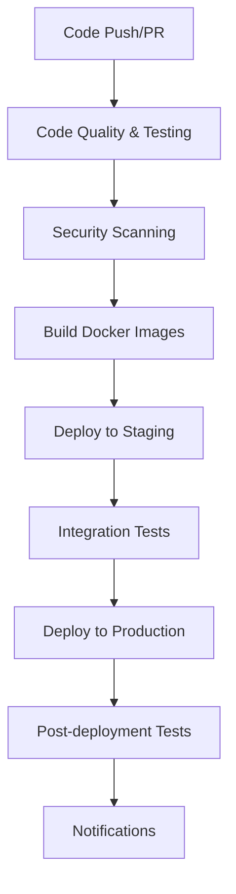

# CI/CD Pipeline Guide for Summarize This

This guide explains the Continuous Integration and Continuous Deployment (CI/CD) pipeline implemented for the Summarize This application using GitHub Actions.

## Table of Contents

1. [Overview](#overview)
2. [Pipeline Architecture](#pipeline-architecture)
3. [Workflow Files](#workflow-files)
4. [Setup Instructions](#setup-instructions)
5. [Environment Configuration](#environment-configuration)
6. [Security and Secrets](#security-and-secrets)
7. [Deployment Strategies](#deployment-strategies)
8. [Monitoring and Notifications](#monitoring-and-notifications)
9. [Troubleshooting](#troubleshooting)
10. [Best Practices](#best-practices)

## Overview

The CI/CD pipeline automates the following processes:
- **Code Quality**: Linting, type checking, and code formatting
- **Testing**: Unit tests, integration tests, and security scans
- **Building**: Docker image creation and artifact generation
- **Security**: Vulnerability scanning and dependency audits
- **Deployment**: Automated deployment to staging and production
- **Monitoring**: Performance testing and health checks

## Pipeline Architecture

### Workflow Triggers

The pipeline is triggered by:
- **Push** to `main` or `develop` branches
- **Pull Requests** to `main` branch
- **Release** creation (tags starting with `v`)
- **Schedule** (daily security scans)
- **Manual** workflow dispatch

### Pipeline Stages



## Workflow Files

The CI/CD pipeline consists of four main workflow files:

### 1. Main CI/CD Pipeline (`.github/workflows/ci.yml`)

**Purpose**: Primary pipeline for testing, building, and deployment

**Triggers**:
- Push to `main`, `develop`
- Pull requests to `main`
- Release creation

**Jobs**:
- `test`: Code quality checks and testing
- `build`: Docker image building and pushing
- `security`: Security vulnerability scanning
- `deploy-staging`: Deployment to staging environment
- `deploy-production`: Deployment to production environment
- `performance`: Performance testing
- `cleanup`: Resource cleanup

### 2. Release Pipeline (`.github/workflows/release.yml`)

**Purpose**: Automated release creation and distribution

**Triggers**:
- Tags starting with `v*` (e.g., `v1.0.0`)

**Jobs**:
- `create-release`: GitHub release creation
- `build-electron`: Cross-platform Electron app builds
- `build-docker`: Multi-architecture Docker images
- `deploy-production`: Production deployment
- `notify`: Stakeholder notifications

### 3. Security Pipeline (`.github/workflows/security.yml`)

**Purpose**: Comprehensive security scanning

**Triggers**:
- Daily schedule (2 AM UTC)
- Push to `main`, `develop`
- Pull requests to `main`
- Manual dispatch

**Jobs**:
- `dependency-scan`: NPM audit and Snyk scanning
- `code-security`: CodeQL and Semgrep analysis
- `docker-security`: Container image vulnerability scanning
- `secret-scan`: Secret detection with TruffleHog and GitLeaks
- `infrastructure-security`: Infrastructure as Code scanning
- `security-report`: Consolidated security reporting

### 4. Dependency Updates (`.github/workflows/dependency-update.yml`)

**Purpose**: Automated dependency management

**Triggers**:
- Weekly schedule (Mondays at 9 AM UTC)
- Manual dispatch

**Jobs**:
- `update-dependencies`: Regular dependency updates
- `security-updates`: Security vulnerability fixes
- `notify`: Update notifications

## Setup Instructions

### 1. Repository Configuration

1. **Enable GitHub Actions**:
   - Go to repository Settings → Actions → General
   - Allow all actions and reusable workflows

2. **Configure Branch Protection**:
   - Settings → Branches → Add rule for `main`
   - Require status checks to pass before merging
   - Require branches to be up to date before merging

3. **Set up Environments**:
   - Settings → Environments
   - Create `staging` and `production` environments
   - Configure environment protection rules

### 2. Required Secrets

Configure the following secrets in repository settings:

#### GitHub Secrets (Settings → Secrets and variables → Actions)

```bash
# Container Registry
GITHUB_TOKEN  # Automatically provided

# Security Scanning
SNYK_TOKEN    # Snyk API token for vulnerability scanning

# Deployment (if using external services)
DEPLOY_KEY    # SSH key for deployment servers
KUBE_CONFIG   # Kubernetes configuration (base64 encoded)

# Notifications
SLACK_WEBHOOK_URL     # Slack webhook for notifications
DISCORD_WEBHOOK_URL   # Discord webhook for notifications

# External Services (if needed)
AWS_ACCESS_KEY_ID     # AWS credentials for deployment
AWS_SECRET_ACCESS_KEY
AZURE_CREDENTIALS     # Azure service principal
GCP_SA_KEY           # Google Cloud service account key
```

#### Environment Secrets

For each environment (`staging`, `production`):

```bash
# Application Configuration
DATABASE_URL
REDIS_URL
MONGODB_URI

# API Keys
OPENAI_API_KEY
STRIPE_SECRET_KEY

# Security
JWT_SECRET
SESSION_SECRET
ENCRYPTION_KEY

# Email Configuration
SMTP_HOST
SMTP_USER
SMTP_PASS
```

### 3. Container Registry Setup

The pipeline uses GitHub Container Registry (ghcr.io) by default:

1. **Enable Container Registry**:
   - Repository Settings → General → Features
   - Enable "Packages"

2. **Configure Package Permissions**:
   - Package settings → Manage Actions access
   - Allow repository access

## Environment Configuration

### Staging Environment

**Purpose**: Pre-production testing and validation

**Configuration**:
- Deployed on every push to `develop` branch
- Uses staging-specific environment variables
- Includes additional debugging and monitoring
- Automated smoke tests after deployment

**Access**:
- URL: `https://staging.summarizethis.com`
- Protected by basic authentication
- Limited external API access

### Production Environment

**Purpose**: Live application serving end users

**Configuration**:
- Deployed on push to `main` branch or release creation
- Production-optimized settings
- Full monitoring and alerting
- Comprehensive health checks

**Access**:
- URL: `https://summarizethis.com`
- Full SSL/TLS encryption
- CDN and caching enabled

## Security and Secrets

### Secret Management Best Practices

1. **Never commit secrets** to version control
2. **Use environment-specific secrets** for different deployment stages
3. **Rotate secrets regularly** (quarterly recommended)
4. **Limit secret access** to necessary workflows only
5. **Monitor secret usage** through audit logs

### Security Scanning Tools

#### 1. Dependency Scanning
- **NPM Audit**: Built-in Node.js vulnerability scanner
- **Snyk**: Commercial vulnerability database
- **GitHub Dependabot**: Automated dependency updates

#### 2. Code Analysis
- **CodeQL**: GitHub's semantic code analysis
- **Semgrep**: Static analysis for security patterns
- **ESLint Security Plugin**: JavaScript security linting

#### 3. Container Security
- **Trivy**: Comprehensive vulnerability scanner
- **Grype**: Container image vulnerability scanner
- **Docker Scout**: Docker's security scanning

#### 4. Secret Detection
- **TruffleHog**: Git history secret scanning
- **GitLeaks**: Secret detection in code
- **GitHub Secret Scanning**: Built-in secret detection

### Security Workflow Configuration

```yaml
# Example security job configuration
security-scan:
  runs-on: ubuntu-latest
  permissions:
    contents: read
    security-events: write
  steps:
    - uses: actions/checkout@v4
    - name: Run Trivy scanner
      uses: aquasecurity/trivy-action@master
      with:
        image-ref: 'myapp:latest'
        format: 'sarif'
        output: 'trivy-results.sarif'
    - name: Upload to GitHub Security
      uses: github/codeql-action/upload-sarif@v2
      with:
        sarif_file: 'trivy-results.sarif'
```

## Deployment Strategies

### 1. Blue-Green Deployment

**Concept**: Maintain two identical production environments

**Implementation**:
```yaml
deploy-blue-green:
  steps:
    - name: Deploy to Blue Environment
      run: kubectl apply -f k8s/blue/
    - name: Run Health Checks
      run: ./scripts/health-check.sh blue
    - name: Switch Traffic
      run: kubectl patch service app -p '{"spec":{"selector":{"version":"blue"}}}'
    - name: Cleanup Green Environment
      run: kubectl delete -f k8s/green/
```

### 2. Rolling Deployment

**Concept**: Gradually replace instances with new versions

**Implementation**:
```yaml
deploy-rolling:
  steps:
    - name: Update Deployment
      run: kubectl set image deployment/app app=myapp:${{ github.sha }}
    - name: Wait for Rollout
      run: kubectl rollout status deployment/app
```

### 3. Canary Deployment

**Concept**: Deploy to a subset of users first

**Implementation**:
```yaml
deploy-canary:
  steps:
    - name: Deploy Canary
      run: kubectl apply -f k8s/canary/
    - name: Monitor Metrics
      run: ./scripts/monitor-canary.sh
    - name: Promote or Rollback
      run: ./scripts/canary-decision.sh
```

## Monitoring and Notifications

### Pipeline Monitoring

**GitHub Actions Dashboard**:
- Workflow run history
- Success/failure rates
- Performance metrics
- Resource usage

**Custom Monitoring**:
```yaml
- name: Send Metrics to Monitoring
  run: |
    curl -X POST $MONITORING_ENDPOINT \
      -H "Content-Type: application/json" \
      -d '{"pipeline": "ci", "status": "${{ job.status }}", "duration": "${{ steps.duration.outputs.time }}"}'
```

### Notification Configuration

#### Slack Integration
```yaml
- name: Notify Slack
  if: failure()
  uses: 8398a7/action-slack@v3
  with:
    status: ${{ job.status }}
    channel: '#deployments'
    webhook_url: ${{ secrets.SLACK_WEBHOOK_URL }}
```

#### Discord Integration
```yaml
- name: Notify Discord
  if: always()
  uses: sarisia/actions-status-discord@v1
  with:
    webhook: ${{ secrets.DISCORD_WEBHOOK_URL }}
    status: ${{ job.status }}
```

#### Email Notifications
```yaml
- name: Send Email
  if: failure()
  uses: dawidd6/action-send-mail@v3
  with:
    server_address: smtp.gmail.com
    server_port: 587
    username: ${{ secrets.SMTP_USER }}
    password: ${{ secrets.SMTP_PASS }}
    subject: "Deployment Failed: ${{ github.repository }}"
    body: "Pipeline failed for commit ${{ github.sha }}"
    to: team@company.com
```

## Troubleshooting

### Common Issues

#### 1. Build Failures

**Symptoms**: Docker build fails or times out

**Solutions**:
```bash
# Check build logs
gh run view <run-id> --log

# Local debugging
docker build --no-cache -t test .

# Check resource limits
# Increase runner resources or optimize Dockerfile
```

#### 2. Test Failures

**Symptoms**: Tests fail in CI but pass locally

**Solutions**:
```bash
# Check environment differences
env | grep NODE_ENV

# Run tests with CI environment
NODE_ENV=test npm test

# Check service dependencies
docker-compose -f docker-compose.test.yml up -d
```

#### 3. Deployment Issues

**Symptoms**: Deployment fails or times out

**Solutions**:
```bash
# Check deployment logs
kubectl logs deployment/app

# Verify secrets and configuration
kubectl get secrets
kubectl describe configmap app-config

# Check resource availability
kubectl top nodes
kubectl describe pod <pod-name>
```

#### 4. Security Scan Failures

**Symptoms**: Security scans block deployment

**Solutions**:
```bash
# Review security report
gh run view <run-id> --log | grep -A 10 "security"

# Fix vulnerabilities
npm audit fix
npm update

# Temporary bypass (use carefully)
# Add to workflow: continue-on-error: true
```

### Debugging Commands

```bash
# View workflow runs
gh run list

# View specific run details
gh run view <run-id>

# Download run logs
gh run download <run-id>

# Re-run failed jobs
gh run rerun <run-id> --failed

# Cancel running workflow
gh run cancel <run-id>
```

## Best Practices

### 1. Workflow Design

- **Keep workflows focused**: One responsibility per workflow
- **Use reusable workflows**: Share common logic across repositories
- **Implement proper error handling**: Use `continue-on-error` judiciously
- **Optimize for speed**: Use caching and parallel jobs
- **Document workflows**: Add clear descriptions and comments

### 2. Security

- **Principle of least privilege**: Grant minimal necessary permissions
- **Regular security updates**: Keep actions and dependencies updated
- **Secret rotation**: Regularly rotate all secrets and tokens
- **Audit access**: Review who has access to secrets and workflows
- **Monitor for anomalies**: Set up alerts for unusual pipeline behavior

### 3. Testing

- **Test early and often**: Run tests on every commit
- **Comprehensive coverage**: Include unit, integration, and e2e tests
- **Parallel execution**: Run tests in parallel to reduce time
- **Fail fast**: Stop pipeline on critical test failures
- **Test environments**: Use consistent test environments

### 4. Deployment

- **Gradual rollouts**: Use canary or blue-green deployments
- **Health checks**: Implement comprehensive health monitoring
- **Rollback strategy**: Have automated rollback procedures
- **Database migrations**: Handle schema changes carefully
- **Zero-downtime**: Design deployments to avoid service interruption

### 5. Monitoring

- **Pipeline metrics**: Track success rates, duration, and failures
- **Application metrics**: Monitor deployed application health
- **Alert fatigue**: Configure meaningful alerts only
- **Dashboard visibility**: Create dashboards for team visibility
- **Post-mortem process**: Learn from failures and improve

### 6. Documentation

- **Workflow documentation**: Document each workflow's purpose
- **Runbook creation**: Provide troubleshooting guides
- **Change logs**: Track pipeline changes and their impact
- **Team training**: Ensure team understands the pipeline
- **Regular reviews**: Periodically review and update processes

## Advanced Configuration

### Matrix Builds

Test across multiple environments:
```yaml
strategy:
  matrix:
    node-version: [16, 18, 20]
    os: [ubuntu-latest, windows-latest, macos-latest]
```

### Conditional Workflows

Run jobs based on conditions:
```yaml
if: github.event_name == 'push' && github.ref == 'refs/heads/main'
```

### Custom Actions

Create reusable actions:
```yaml
# .github/actions/setup-app/action.yml
name: 'Setup Application'
description: 'Setup Node.js and install dependencies'
runs:
  using: 'composite'
  steps:
    - uses: actions/setup-node@v4
      with:
        node-version: '18'
        cache: 'npm'
    - run: npm ci
      shell: bash
```

### Workflow Templates

Create organization-wide templates:
```yaml
# .github/workflow-templates/node-ci.yml
name: Node.js CI
on: [push, pull_request]
jobs:
  test:
    runs-on: ubuntu-latest
    steps:
      - uses: actions/checkout@v4
      - uses: ./.github/actions/setup-app
      - run: npm test
```

## Support and Resources

### Documentation
- [GitHub Actions Documentation](https://docs.github.com/en/actions)
- [Docker Documentation](https://docs.docker.com/)
- [Kubernetes Documentation](https://kubernetes.io/docs/)

### Community
- [GitHub Actions Community](https://github.com/actions/community)
- [Docker Community](https://www.docker.com/community)
- [DevOps Stack Exchange](https://devops.stackexchange.com/)

### Tools
- [GitHub CLI](https://cli.github.com/) - Command-line interface for GitHub
- [Act](https://github.com/nektos/act) - Run GitHub Actions locally
- [Workflow Visualizer](https://github.com/actions/workflow-visualizer) - Visualize workflow dependencies

---

This CI/CD pipeline provides a robust foundation for automated testing, building, and deployment of the Summarize This application. Regular review and optimization of the pipeline will ensure it continues to meet the project's evolving needs.

